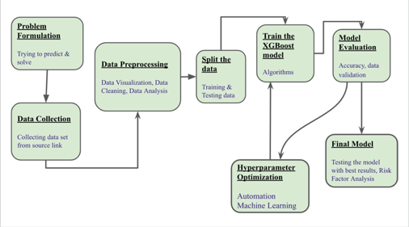

**Project Overview**

To predict the future stock prices and the risk in buying/selling the stocks by analyzing the previous performance history of the stocks.

Although we have many models based on decision trees. All these models have some disadvantages of having biased overfitting, poor handling of missing values and more computational. As XGBoost overcome all the problems and showed better results in prediction we would like to use XGBoost algorithm in Automated machine learning using Hyperparameter Optimization to predict future stock prices.

To predict the future stock prices by analyzing the previous performance history of the stocks using Logistic Regression and Xgboost Automated machine learning algorithms and show how Xgboost Outperforms and gives best results.

**WorkFlow**

**Technology Stack**
Jupyter Notebook,
Python 3.7

